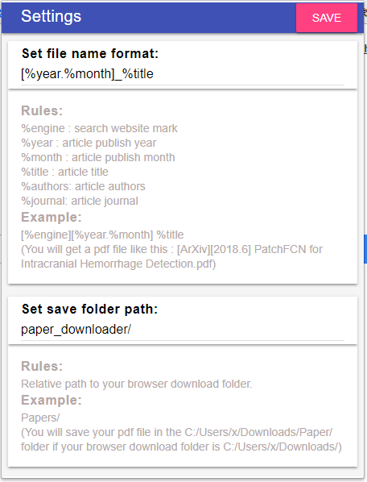

# What is PaperDownloader?

Have you ever bothered with the meaningless name of pdf downloaded from IEEE ( such as `08353462.pdf` ) or other scientific website. This plugin can help you dealing with this problem.
	It can auto download paper you selected and rename it by the format you defined. (such as `[engine][year.month] title`, then the `08353462.pdf` will be renamed as `[IEEE][2018.5] Isotropic Estimators of Local Background Statistics for Target Detection in Imagery.pdf` ). 


## Which websites are supported?

​	Currently, the support websites are:

- [ieeexplore.ieee.org](https://ieeexplore.ieee.org/)

- [sciencedirect.com](https://www.sciencedirect.com/)

- [library.seg.org](https://library.seg.org/)

- [arXiv.org](https://arxiv.org/search/)

- [cnki](http://www.cnki.net/)

## Wich browsers are supported?

- Chrome browser（谷歌浏览器）
- Chromium browser (谷歌开源浏览器)
- 360 browser （360安全浏览器）
- CM browser   (猎豹浏览器)
- UC browser  (UC Web浏览器)
- QQ browser (QQ浏览器)
- Baidu browser （百度浏览器）
- Sogou browser （搜狗浏览器）
- Maxthon browser  (遨游浏览器)

## How to install and configure it?

​First, you can install it from chrome webstore or directly download the .crx file and drag it into the browser. if you can see the  in top-right side of the browser, the PaperDownloader is successfully installed.

​Second,  left click the , then the configure page will appear (as follows)



​	Two place you need to configure. 

 - One is the "Set file name format".

   **Rules:**

   ```
   %engine : search website mark 
   %year : article publish year 
   %month : article publish month 
   %title : article title 
   %authors: article authors 
   %journal: article journal 
   ```

   **Example:**

   ```
   [%engine][%year.%month] %title
   ```

   ​	(You will get a pdf file like this : **_[ArXiv][2018.6] PatchFCN for Intracranial Hemorrhage Detection.pdf_**)

- The other is the "Set save folder path".

  **Rules:**

  Relative path to your browser download folder.

  **Example:**

  ```
  Papers/  
  ```

  (You will save your pdf file in the `C:/Users/x/Downloads/Paper/` folder if your browser download folder is `C:/Users/x/Downloads/`)

## How to use it?

There are usually TWO situations you want to download some papers from the scientific website.

- You have some keywords and you want to find some papers related with these keywords.
- You are interested in some journals and you want to know what current issues in this journal talk about.


The way to use it:

1. you search papers by keywords in the scientific website, such as https://ieeexplore.ieee.org/. then a list of papers related to this keywords will be presented in this page. Or you look at the current issue or early access in some journals, such as TGRS (https://ieeexplore.ieee.org/xpl/tocresult.jsp?isnumber=4358825), then a list of papers in this issue will be presented in this page.
2. After a short review, you may think some papers are useful and want to download. then you pitch on the checkbox in the items.
3. After you pitch the all checkbox of the papers you want to download, just right-click the mouse, select  "Downloading..." in the context menu.
4. Then the papers will be download automatic with the formated name.


## Notice

Currently the chrome extension only support to download the papers which you have permission to access.